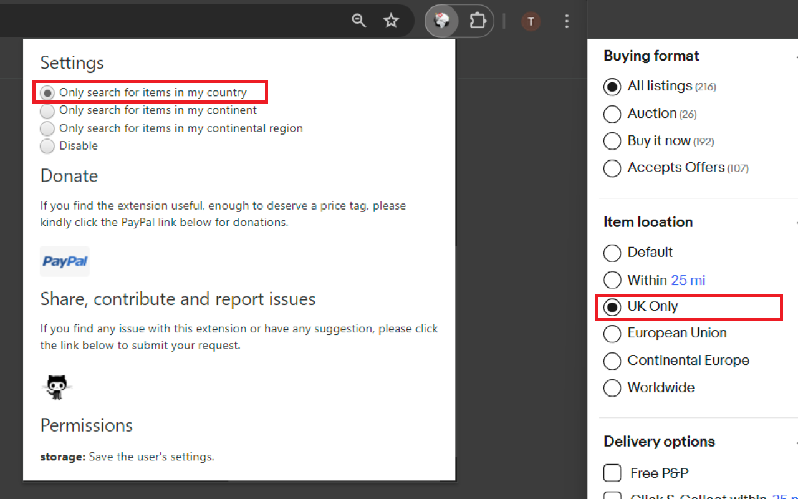

# eBay item location - My country only

As a frequent eBay user, I almost always found myself starting my search by first setting the filter for items in my location only. Despite the long running feedback from many users on the need for the stickiness of item location preference, eBay has yet to provide a solution. 

To facilitate a more efficient search, I designed an extension that defaults my eBay searches to only items in my location. It has saved me a lot of time and has been serving me very well so I'm publishing the extension for everyone's use.

<a href="https://chrome.google.com/webstore/detail/ebay-item-location-my-cou/efhmejgmpncbkkofodbkcgmmflmjbmbo">Install on chrome from Google web store.</a>

<a href="https://addons.mozilla.org/en-GB/firefox/addon/ebay-search-my-country-only/?src=search">Install on firefox from Mozilla Add-ons store</a>

